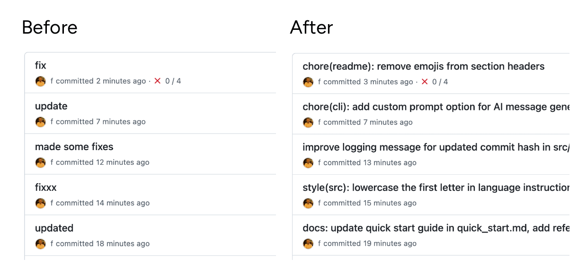

# $ npx git-rewrite-commits

> AI-powered git commit message rewriter using GPT



[](https://www.npmjs.com/package/git-rewrite-commits)
[](https://github.com/f/git-rewrite-commits/packages)
[](https://f.github.io/git-rewrite-commits/)
[](https://opensource.org/licenses/MIT)

Automatically rewrite your entire git commit history with better, conventional commit messages using AI. Perfect for cleaning up messy commit histories before open-sourcing projects or improving repository maintainability.

## Important Disclaimer

> **This tool rewrites git history, which is generally NOT recommended for shared repositories!**
> 
> **When to use:**
> - Personal projects before making them public
> - Feature branches before merging (with team agreement)
> - Cleaning up local commits before pushing
> - Preparing repositories for open-sourcing
> 
> **When NOT to use:**
> - On shared branches without team coordination
> - After pushing commits that others have pulled
> - On main/master branches of team projects
> - In repositories where commit hashes are referenced
> 
> **Remember:** Rewriting history changes commit hashes and requires force-pushing, which can disrupt your team's workflow.

## Features

- **AI-Powered**: Uses OpenAI's GPT models to generate meaningful commit messages
- **One-Command Hook Setup**: Install git hooks instantly with `npx git-rewrite-commits --install-hooks`
- **Smart Detection**: Automatically skips well-formed commits (can be disabled)
- **Quality Scoring**: Assesses commit quality and only fixes broken messages
- **Custom Templates**: Define your own commit format with `--template`
- **Custom Prompts**: Override AI behavior with `--prompt` for unique styles
- **Multi-language**: Generate messages in 20+ languages
- **Conventional Commits**: Follows conventional commit standards (feat, fix, docs, etc.)
- **Safe**: Automatically creates backup branches before rewriting
- **Flexible**: Supports dry-run mode to preview changes
- **Customizable**: Choose your preferred AI model and processing options
- **Progress Tracking**: Real-time progress indicators with colored output
- **Efficient**: Process only the last N commits for faster operation

## Installation

You can run this tool directly with npx (no installation required):

```bash
npx git-rewrite-commits
```

Or install it globally:

### From npm Registry
```bash
npm install -g git-rewrite-commits
```

### From GitHub Packages
```bash
npm install -g @f/git-rewrite-commits --registry https://npm.pkg.github.com
```

**Note:** For GitHub Packages, you'll need to authenticate first:
```bash
npm login --registry=https://npm.pkg.github.com --scope=@f
```

## Quick Hook Installation

**One command to enable AI-powered commit messages:**

```bash
npx git-rewrite-commits --install-hooks
```

That's it! Now you get:
- **Automatic AI messages** when you run `git commit`
- **Post-commit improvement** after each commit
- **Pre-push review** before pushing to remote

> **See [QUICK_START.md](QUICK_START.md) for detailed setup guide**

### Configure (Optional)

```bash
# Set your template format
git config hooks.commitTemplate "[JIRA-XXX] feat: message"

# Set language
git config hooks.commitLanguage "es"  # Spanish, French, etc.
```

## Real-World Examples

### Automatic Post-Commit Hook (Fix commits as you work)

Add to `.git/hooks/post-commit` to automatically improve your last commit message:

```bash
#!/bin/sh
# Automatically improve the last commit message after each commit
npx git-rewrite-commits --max-commits 1 --skip-backup --no-skip-well-formed
```

Make it executable: `chmod +x .git/hooks/post-commit`

**Or use our ready-made hook:** `cp hooks/post-commit .git/hooks/`

### Pre-Push Hook (Clean up before pushing)

Add to `.git/hooks/pre-push` to fix commits before pushing:

```bash
#!/bin/sh
# Clean up the last 5 commits before pushing
echo "🔧 Improving commit messages before push..."
npx git-rewrite-commits --max-commits 5 --dry-run

echo "Apply changes? (y/n)"
read answer
if [ "$answer" = "y" ]; then
    npx git-rewrite-commits --max-commits 5
fi
```

### Alias for Quick Fixes

Add to your `~/.gitconfig` or `~/.zshrc`/`~/.bashrc`:

```bash
# Git alias
git config --global alias.fix-commits '!npx git-rewrite-commits --max-commits'

# Usage: git fix-commits 3
```

```bash
# Shell alias
alias fix-last-commit='npx git-rewrite-commits --max-commits 1 --skip-backup'
alias fix-branch='npx git-rewrite-commits --max-commits 20'

# Usage: fix-last-commit
```

### Team Workflow: Feature Branch Cleanup

Before creating a pull request:

```bash
# 1. Check what needs fixing
npx git-rewrite-commits --dry-run --max-commits 10

# 2. Apply improvements
npx git-rewrite-commits --max-commits 10

# 3. Force push to your feature branch
git push --force-with-lease origin feature-branch
```

### CI/CD Integration

Add to your CI pipeline (e.g., GitHub Actions) for PR validation:

```yaml
- name: Check Commit Quality
  run: |
    npx git-rewrite-commits --dry-run --max-commits ${{ github.event.pull_request.commits }}
    # This will show which commits would be improved
```

### Preparing for Open Source

Before making a private repo public:

```bash
# Fix all commits with custom template
npx git-rewrite-commits \
  --template "feat(scope): message" \
  --language en \
  --no-skip-well-formed

# Review the changes
git log --oneline -20

# If satisfied, force push
git push --force-with-lease origin main
```

## Quick Start

### Option 1: Enable AI Commits Automatically (Recommended)

1. **Set up your OpenAI API key:**
   ```bash
   export OPENAI_API_KEY="your-api-key-here"
   ```

2. **Install git hooks in your repository:**
   ```bash
   cd your-repo
   npx git-rewrite-commits --install-hooks
   ```

3. **That's it! Now just commit normally:**
   ```bash
   git add .
   git commit  # AI message appears automatically!
   ```

### Option 2: Rewrite Existing History

1. **Set up your OpenAI API key** (same as above)

2. **Navigate to your git repository:**
   ```bash
   cd your-repo
   ```

3. **Run the tool:**
   ```bash
   npx git-rewrite-commits  # Rewrites all commits
   npx git-rewrite-commits --max-commits 10  # Only last 10
   ```

## Usage

### Basic Usage

```bash
# Use with environment variable OPENAI_API_KEY
npx git-rewrite-commits

# Or provide API key directly
npx git-rewrite-commits --api-key "sk-..."
```

### Options

```
Options:
  -V, --version                 output the version number
  -k, --api-key <key>           OpenAI API key (defaults to OPENAI_API_KEY env var)
  -m, --model <model>           OpenAI model to use (default: "gpt-3.5-turbo")
  -b, --branch <branch>         Branch to rewrite (defaults to current branch)
  -d, --dry-run                 Show what would be changed without modifying repository
  -v, --verbose                 Show detailed output
  --max-commits <number>        Process only the last N commits
  --skip-backup                 Skip creating a backup branch (not recommended)
  --no-skip-well-formed         Process all commits, even well-formed ones
  --min-quality-score <score>   Minimum quality score (1-10) to consider well-formed (default: 7)
  -t, --template <format>       Custom commit message template (e.g., "(feat): message")
  -l, --language <lang>         Language for commit messages (default: "en")
  -p, --prompt <text>           Custom prompt for AI message generation
  --staged                      Generate a message for staged changes (for git hooks)
  --install-hooks               Install git hooks to the current repository
  -h, --help                    display help for command
```

### Examples

```bash
# Preview changes without modifying history (recommended first step)
npx git-rewrite-commits --dry-run

# Use GPT-4 for better quality messages
npx git-rewrite-commits --model gpt-4

# Process only the last 10 commits (most recent)
npx git-rewrite-commits --max-commits 10

# Process ALL commits, including well-formed ones
npx git-rewrite-commits --no-skip-well-formed

# Set stricter quality threshold (8/10 instead of default 7/10)
npx git-rewrite-commits --min-quality-score 8

# Use custom commit format templates
npx git-rewrite-commits --template "(feat): message"
npx git-rewrite-commits --template "[JIRA-123] feat: message"
npx git-rewrite-commits --template "feat: message"

# Generate commit messages in different languages
npx git-rewrite-commits --language es  # Spanish
npx git-rewrite-commits --language fr  # French
npx git-rewrite-commits --language zh  # Chinese
npx git-rewrite-commits --language ja  # Japanese

# Generate message for staged changes (great for git hooks!)
npx git-rewrite-commits --staged
npx git-rewrite-commits --staged --template "[JIRA-123] feat: message"

# Use custom prompts for unique message styles
npx git-rewrite-commits --prompt "Generate a commit message with emojis and enthusiasm"
npx git-rewrite-commits --prompt "Write a haiku-style commit message"
npx git-rewrite-commits --prompt "Be extremely technical and detailed"
npx git-rewrite-commits --prompt "Follow Linux kernel commit style"

# Install git hooks to your repository
npx git-rewrite-commits --install-hooks

# Verbose mode for debugging
npx git-rewrite-commits --verbose
```

## Custom Templates

You can define your own commit message format using the `--template` option. The tool will follow your template pattern while generating meaningful descriptions.

### Template Examples:
- `"(feat): message"` → `(feat): add user authentication`
- `"[JIRA-XXX] type: message"` → `[JIRA-123] fix: resolve null pointer`
- `"feat: message"` → `feat: implement new dashboard`
- `"type(scope): message"` → `fix(auth): handle expired tokens`

## Custom Prompts

The `--prompt` option allows you to completely customize how the AI generates commit messages. This overrides the default instructions, giving you full creative control.

### Creative Examples:

**Emoji-rich commits:**
```bash
npx git-rewrite-commits --prompt "Generate fun commit messages with relevant emojis"
# Result: "🐛 fix: squash the authentication bug"
```

**Haiku-style commits:**
```bash
npx git-rewrite-commits --prompt "Write commit messages as haikus"
# Result: "auth middleware fix / tokens validate properly / users rejoice now"
```

**Technical detail:**
```bash
npx git-rewrite-commits --prompt "Be extremely technical, mention specific functions and variables"
# Result: "fix(auth): refactor validateJWT() to handle malformed exp claim in token payload"
```

**Team-specific style:**
```bash
npx git-rewrite-commits --prompt "Follow our team style: start with ticket number, be casual but clear"
# Result: "TECH-123 - fixed that annoying auth bug everyone was complaining about"
```

### Combining with Templates:
```bash
# Custom prompt + template format
npx git-rewrite-commits \
  --template "[JIRA-XXX] type: message" \
  --prompt "Be concise and focus on business impact"
```

## Smart Commit Detection

The tool automatically assesses each commit message quality based on:

- **Conventional format**: Following feat/fix/docs/etc. patterns (4 points)
- **Appropriate length**: Between 10-72 characters (2 points)
- **Descriptive content**: Not generic like "update" or "fix" (2 points)
- **Present tense**: Following best practices (1 point)
- **No trailing period**: Clean formatting (1 point)

Messages scoring 7/10 or higher are considered well-formed and skipped by default. Use `--no-skip-well-formed` to process all commits or `--min-quality-score` to adjust the threshold.

## Safety Features

1. **Backup Branch**: Automatically creates a backup branch before rewriting
2. **Confirmation Prompts**: Asks for confirmation at critical steps
3. **Dry Run Mode**: Preview all changes without modifying your repository
4. **Uncommitted Changes Warning**: Alerts you about uncommitted changes

## Important Notes

### Before Using

- **This tool rewrites git history!** This is a destructive operation.
- Always work on a separate branch, not on main/master
- Create a manual backup of your repository
- Coordinate with your team if working on a shared repository

### After Rewriting

1. **Review the changes:**
   ```bash
   git log --oneline
   ```

2. **If satisfied, force push to remote:**
   ```bash
   git push --force-with-lease
   ```

3. **If something went wrong, restore from backup:**
   ```bash
   git reset --hard backup-branch-name
   ```

4. **Clean up backup branch when done:**
   ```bash
   git branch -D backup-branch-name
   ```

## Conventional Commit Types

The tool generates commit messages following these conventional types:

- `feat`: A new feature
- `fix`: A bug fix
- `docs`: Documentation only changes
- `style`: Changes that don't affect code meaning (formatting, etc.)
- `refactor`: Code change that neither fixes a bug nor adds a feature
- `test`: Adding or correcting tests
- `chore`: Changes to build process or auxiliary tools
- `perf`: Performance improvements
- `ci`: CI/CD configuration changes
- `build`: Changes affecting build system or dependencies
- `revert`: Reverting a previous commit

## Configuration

### Environment Variables

- `OPENAI_API_KEY`: Your OpenAI API key (required)

### Supported Models

- `gpt-3.5-turbo` (default) - Fast and cost-effective
- `gpt-4o` - Latest GPT model

## Development

### Setup

```bash
# Clone the repository
git clone https://github.com/f/git-rewrite-commits.git
cd git-rewrite-commits

# Install dependencies
npm install

# Build the project
npm run build
```

### Running Locally

```bash
# Run in development mode
npm run dev

# Build and run
npm run build
node dist/cli.js
```

## How It Works

1. **Analyzes each commit**: Reads the diff, changed files, and original message
2. **Generates new message**: Uses AI to create a conventional commit message
3. **Creates backup**: Saves current state in a backup branch
4. **Rewrites history**: Uses `git filter-branch` to apply new messages
5. **Provides recovery options**: Keeps backup branch for restoration if needed

## Contributing

Contributions are welcome! Please feel free to submit a Pull Request. For major changes, please open an issue first to discuss what you would like to change.

1. Fork the repository
2. Create your feature branch (`git checkout -b feature/AmazingFeature`)
3. Commit your changes (using conventional commits!)
4. Push to the branch (`git push origin feature/AmazingFeature`)
5. Open a Pull Request

## License

This project is licensed under the MIT License - see the [LICENSE](LICENSE) file for details.

## Acknowledgments

- OpenAI for providing the GPT API
- The conventional commits specification
- The git community for powerful version control tools

## Bug Reports

If you discover any bugs, please create an issue [here](https://github.com/f/git-rewrite-commits/issues).

## Contact

For questions and support, please open an issue in the GitHub repository.

---

**Remember: Always backup your repository before rewriting history!** 🔒
